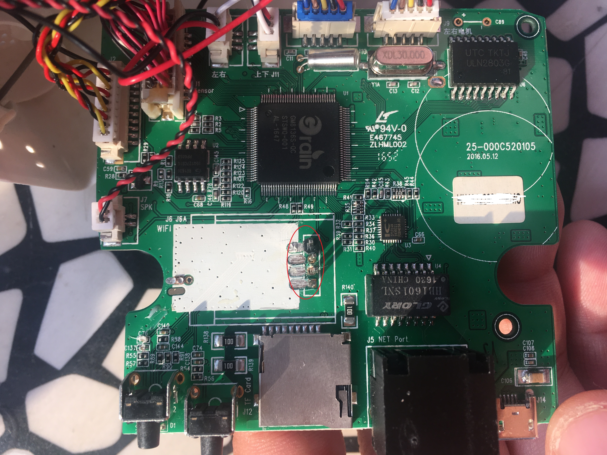

# ZTE_520_Caramer
进行中的项目......

从朋友手中得到了一个ZTE_C520的小兴看看，可惜的是，这个设备被其他手机绑定了。
他有一个后台系统，但是后台系统的密码需要在手机端才能查询的到。
也就是说必须有绑定的手机跟设备同时存在，才可以用此设备，否则光拿着设备是没用的。这点做的非常的好，提高了安全系数，值得我们借鉴。

## 下载官方ROM 
    
    [官方rom下载地址](http://www.ztehome.com.cn/support/searchRsltTable.php?id=64)

    binwalk -e C520_v216t3_firmware.bin

    root@kali:/mnt/hgfs/share/_C520_v216t3_firmware.bin.extracted# ls -la
    total 9586
    drwxrwxrwx 1 root root    4096 Apr  1 04:47 .
    drwxrwxrwx 1 root root    4096 Apr  1 07:52 ..
    -rwxrwxrwx 1 root root 5754880 Apr  1 04:47 280000.squashfs
    -rwxrwxrwx 1 root root 4048132 Apr  1 04:47 47B0
    drwxrwxrwx 1 root root    4096 Oct 26  2016 squashfs-root

## 破解密码
- 从官方rom中，提取出

    /etc/shadow  
    /etc/passwd
    
- 下载john

- 比较幸运，很短时间，算出了密码
        
        [root@VM_102_86_centos run]# ./unshadow passwd shadow > /opt/pas/txt_passwd
        [root@VM_102_86_centos run]# ./john --wordlist=super.txt /opt/pas/txt_passwd           
        Loaded 2 password hashes with no different salts (md5crypt [MD5 32/64 X2])
        Press 'q' or Ctrl-C to abort, almost any other key for status
        12345!@#$%       (zte!!)
        1g 0:00:00:49 100% 0.02006g/s 10787p/s 10787c/s 12796C/s zzzzzzzzz..zzzzzzzzzz
        Use the "--show" option to display all of the cracked passwords reliably
        Session completed
        
**user:zte!!    passwd:12345!@#$%**

        root@kali:~# nmap 192.168.1.108(摄像头ip)

        Starting Nmap 7.60 ( https://nmap.org ) at
        Nmap scan report for 192.168.1.108
        Host is up (0.0052s latency).
        Not shown: 996 closed ports
        PORT      STATE SERVICE
        80/tcp    open  http
        554/tcp   open  rtsp
        873/tcp   open  rsync
        52869/tcp open  unknown
        MAC Address: F0:84:C9:6F:83:F9 (zte)

        Nmap done: 1 IP address (1 host up) scanned in 3.06 seconds

## 开了rsync端口，查看/etc/rsync.conf

        [usb]
        comment = rsync_mgr
        path = /mnt/tf/usb
        auth users = rsync

        [nas]
        comment = rsync_mgr
        path = /mnt/netsrv/nas
        auth users = rsync
      
 ## 查看rsyconf.secrets
        又一个密码产生了。
        rsync:ILoveHomecare
 

## 拆解硬件，用UART进入。。。

红圈内是我焊接上的排针，但很奇怪，用uart线，连接不上，不知道是什么原因

